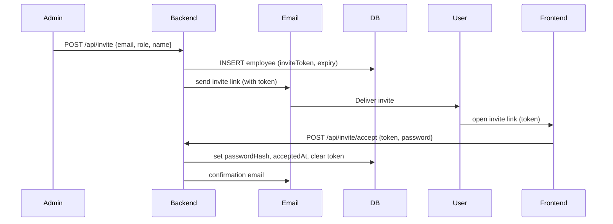
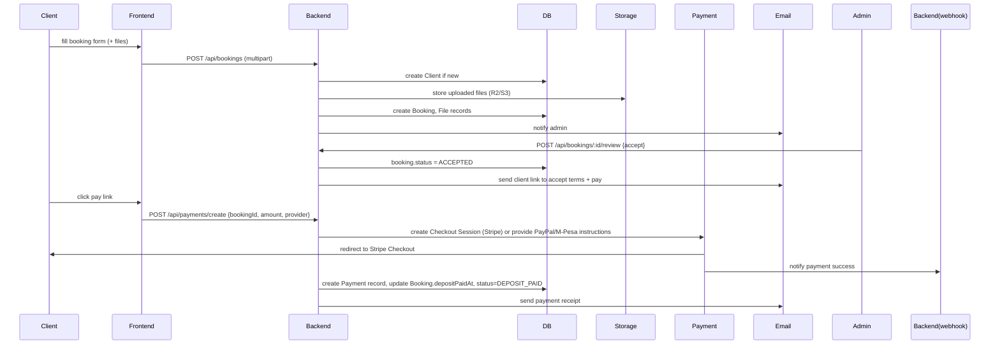

# AngiSoft Technologies — Production Architecture

This document describes the proposed production architecture for the AngiSoft Technologies web platform, including component choices, data model summary, sequence diagrams for core flows (Invite and Booking+Payment), security and operational considerations, and deployment recommendations.

## Goals
- Production-ready, secure, and maintainable platform.
- Relational DB (Postgres) with Prisma ORM for type-safe data access and migrations.
- Scalable infrastructure: Cloudflare (frontend), Postgres (managed), object storage (Cloudflare R2 or S3), Redis for queues, Stripe/PayPal/M-Pesa for payments.
- Full admin CMS control: no static content; all public pages managed from admin.

---

## Component overview
- Frontend: React + Vite (existing). Deploy to Cloudflare Pages/CDN.
- Backend: Node.js + Express + TypeScript, Prisma ORM, hosted on a managed Node host (Render, Fly.io, or container on cloud provider). Containerized Dockerfile included.
- Database: PostgreSQL (managed: Supabase, Neon, AWS RDS) with Prisma migrations.
- File storage: Cloudflare R2 (recommended if using Cloudflare Pages) or AWS S3.
- Email: SendGrid / Postmark / Mailgun for transactional emails (invites, booking updates, receipts).
- Payments: Stripe (primary for card payments), PayPal (optional), M-Pesa via Daraja or certified aggregator.
- Queue/Background: Redis + BullMQ for async jobs (email, webhook handling, file processing).
- Observability: Sentry for errors, Prometheus/Grafana or hosted metrics for monitoring, centralized logs (structured JSON) to Datadog/Logflare.
- CI/CD: GitHub Actions — run lint/test/build, run prisma migrations, deploy to staging/prod.

---

## Core sequence diagrams

### Invite flow (overview)

Mermaid sequence diagram (paste into mermaid viewer):



### Booking + payment flow (overview)



---

## Data model summary
- Employees: invites, roles, profile, credentials.
- Clients: contact info and relations to bookings.
- Bookings: structured details (Json for flexible fields), state machine status, associated files and payments.
- Payments: provider, providerId, amount, status, metadata.
- Services, Projects, BlogPosts: content managed by admin.
- Files: metadata stored in DB, objects in R2/S3.
- Settings & Site content: key/value store for CMS-like content.

The repository already contains a draft Prisma schema at `backend/prisma/schema.prisma`. This schema is intentionally normalized and uses UUIDs as primary keys.

---

## Security & compliance
- Always use HTTPS (Cloudflare + origin TLS).
- Secrets in environment variables; use platform secret management.
- Validate and sanitize all inputs; use parameterized queries (Prisma prevents injection by default).
- Passwords hashed with bcrypt or argon2.
- Payment flows use Stripe Checkout to reduce PCI scope.
- Webhook security: verify provider signatures; process webhooks idempotently.
- Rate limiting on public endpoints (booking forms) and login attempts.
- Implement RBAC for admin endpoints and audit logs for sensitive actions.

---

## Deployment recommendations
- Host frontend on Cloudflare Pages with custom domain `angisoft-technologies.com` and Cloudflare WAF enabled.
- Host backend on a managed Node host (Render, Fly, or container on AWS/GCP) with autoscaling.
- Use managed Postgres (Supabase/Neon/RDS) with automated daily backups and PITR.
- Use Cloudflare R2 for file storage (or S3 with CloudFront if preferred).
- Configure CI to run migrations (`npx prisma migrate deploy`) during deploy with a migration-safe strategy.

---

## Operational suggestions
- Use Redis + BullMQ for background jobs and retry logic.
- Centralize logs (structured JSON) and errors (Sentry) with alerting.
- Monitor payment failures and reconciliation mismatches.
- Periodic backups and restore drills.

---

## Next steps (short-term)
1. Finalize Prisma schema and run local migrations.
2. Implement invite & auth fully (email provider + JWT + RBAC).
3. Implement booking submission and admin review endpoints.
4. Integrate Stripe Checkout for deposits and webhook handlers.
5. Build admin UI for CMS and employee management.

---

## How to run locally (developer)

Copy `.env.example` to `.env` and set `DATABASE_URL`.

```bash
cd backend
npm install
npx prisma generate
npx prisma migrate dev --name init
npm run dev
```

---

If you'd like, I can now: generate ER diagrams from the Prisma schema, implement the invite & auth endpoints with email sending, or produce the Mongo->Postgres ETL script. Which should I do next?
